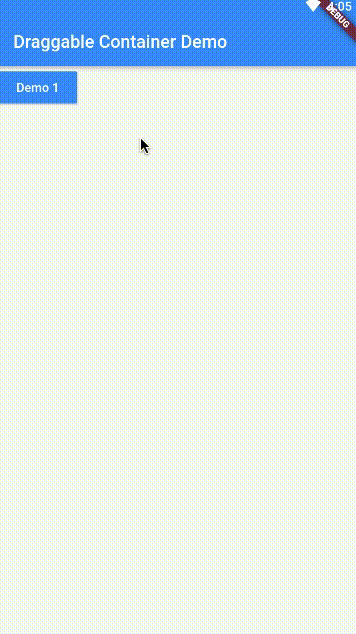

# 可以拖动子部件的容器部件
# A Draggable Widget Container 

## 可拖动子部件，可删除子部件，可以固定子部件位置
## Each children is draggable, deletable, fixable.

## 一些截图 / Screenshots

### 模式 / Mode

- 正常模式 / Normal Mode:
    - 不拦截子部件的手势事件
    - Do not intercept the GestureDetector events of the child widget
    - 不能拖动和删除子部件
    - Can't drag and delete the children widget
    
- 编辑模式 / Edit mode:
    - 长按子部件进入编辑模式
    - Long press the children widget to enter edit mode
    - 进入编辑模式后，不再需要长按来拖动子部件，直接拖动就可以了
    - In edit mode, do not need to long press to drag the children widget
      just drag it.
    - 在可删除子部件上显示删除按钮
    - Show the delete button on the deletable child widget
    - 拦截可拖动可删除的子部件的手势事件
    - Intercept the GestureDetector events of the draggable and deletable child widget
    - 可以拖动和删除子部件
    - Can drag and delete the children widget
    - 返回键 退出编辑模式
    - Press the Back key to exit edit mode.