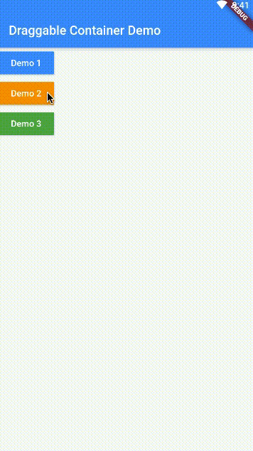

# 可以拖动子部件的容器部件
# A Draggable Widget Container 

## 可拖动子部件，可删除子部件，可以固定子部件位置
## Each children is draggable, deletable, fixable.

## 截图 / Screenshots
- 

- 

- 

### 模式 / Mode

- 正常模式 / Normal Mode:
    - 不拦截子部件的手势事件
    - Do not intercept the GestureDetector events of the child widget
    - 不能拖动和删除子部件
    - Can't drag and delete the children widget
    
- 编辑模式 / Draggable mode:
    - 长按子部件进入编辑模式
    - Long press the children widget to enter the draggable mode
    - 进入编辑模式后，不再需要长按来拖动子部件，直接拖动就可以了
    - In the draggable mode, do not need to long press to drag the children widget,
      just drag it.
    - 在可删除子部件上显示删除按钮
    - Show the delete button on the deletable child widget
    - 拦截可拖动可删除的子部件的手势事件
    - Intercept the GestureDetector events of the draggable and deletable child widget
    - 可以拖动和删除子部件
    - Can drag and delete the children widget
    - 返回键 退出编辑模式
    - Press the Back key to exit the draggable mode.
    
- 事件 / Events
    - onChanged(List<T extends DraggableItem> items)
        - 当子项目改变时触发(拖动过后，删除后)
        - Trigger when the items changed(dragged, deleted)
    - onDraggableModeChanged(bool mode)
        - mode为true则进入了编辑模式，为false则退出了编辑模式.
        - When mode is true then in the draggable mode. If false it mean exited the draggable mode.
    - Future<bool> onBeforeDelete(int index, DraggableItem item)
        - 删除item的确认事件，返回true删除，返回false不删除
        - The event for confirm to delete a item, if return true then delete, if false then no action.